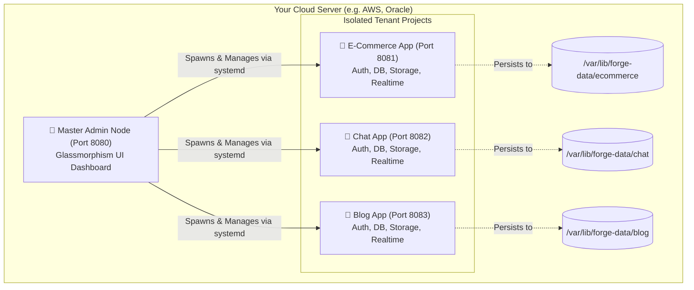

<p align="center">
  <pre>
   ███████╗ ██████╗ ██████╗  ██████╗ ███████╗
   ██╔════╝██╔═══██╗██╔══██╗██╔════╝ ██╔════╝
   █████╗  ██║   ██║██████╔╝██║  ███╗█████╗  
   ██╔══╝  ██║   ██║██╔══██╗██║   ██║██╔══╝  
   ██║     ╚██████╔╝██║  ██║╚██████╔╝███████╗
   ╚═╝      ╚═════╝ ╚═╝  ╚═╝ ╚═════╝ ╚══════╝
  </pre>
</p>

<h3 align="center">A Firebase replacement built from scratch. Zero dependencies. Every byte understood.</h3>

<p align="center">
  
  
  
  
</p>

---

**Forge** is a self-hosted, production-grade, **Multi-Tenant** Backend-as-a-Service (BaaS) platform written entirely in Go with **zero external dependencies**. It provides everything you need to power an entire ecosystem of applications from a single server — authentication, database, storage, realtime, serverless functions, hosting, and analytics — all compiled into a single lightning-fast binary.

## 🚀 Why Forge?

Most modern software is built like a LEGO house using massive pre-made blocks (like PostgreSQL, Redis, or NGINX). Forge was built as a deep engineering challenge to prove that an entire cloud ecosystem can be constructed from first principles.

We didn't import a web server; we read electrical signals off TCP sockets and parsed HTTP requests byte-by-byte. We didn't import a database; we built an in-memory B-Tree with a Write-Ahead Log. Because of this, Forge is incredibly tiny, lighting fast, and completely free of "dependency hell".

## 🏛️ The Architecture

Forge uses a **Master/Child Node Architecture** to host infinite isolated projects on a single machine.



## ✨ The Ecosystem

| Service | Highlights |
|---------|------------|
| 🔐 **Authentication** | Email/password, JWT (RS256), OAuth, and secure OTP email recovery via integrated SMTP (e.g., Brevo). |
| 🗄️ **Database** | Custom NoSQL Document store, structured queries, transactions, batch writes, WAL, and memory snapshots. |
| 📁 **Storage** | File uploads, content-addressable blobs (deduplication), MIME detection, and Signed URLs. |
| ⚡ **Real-Time** | Hand-rolled RFC 6455 WebSockets, pub/sub channels, and live document change streams. |
| ⚙️ **Functions** | Deploy isolated JavaScript/shell scripts, HTTP invocation, cron scheduling. |
| 🌐 **Hosting** | Static site deployment, LRU cache, gzip compression, SPA fallback. |
| 🛡️ **Security Rules** | Custom DSL with a hand-written lexer/parser/evaluator — declarative rules exactly like Firebase. |

## ⚡ Quick Start (Zero to Deployed in 10s)

```bash
# 1. Clone the repo
git clone https://github.com/ayushkunwarsingh/Forge.git
cd Forge

# 2. Build the binary (Requires Go 1.22+)
go build -o forge main.go

# 3. Boot the Master Admin Node (port 8080)
./forge

# 4. Provision a completely isolated backend for your new app!
./run-my-backend "My Awesome App"
```

*Boom. You now have a dedicated backend running on port 8081 ready to connect to your React/Next.js frontend.*

## 📖 Explore the Docs

We believe documentation should be beautiful, simple, and actually helpful.

- 📖 **[The "Simple English" Manual](./DOCUMENTATION.md)** — We explain complex computer science (like B-Trees and Mutex Locks) using real-world analogies (like Filing Cabinets and Apartment Buildings).
- 🤖 **[The AI Integration Guide](./INTEGRATION.md)** — A highly detailed API contract document specifically designed to be copy-pasted into ChatGPT, Cursor, or Copilot so the AI knows exactly how to connect your frontend to Forge.

## 🤝 REST API Teaser

Connecting is as simple as sending JSON. No bulky SDK required.

**Create a User (Triggers an OTP verification email):**
```bash
curl -X POST http://localhost:8081/auth/signup \
  -H "Content-Type: application/json" \
  -d '{"email":"user@example.com","password":"password123"}'
```

**Save a Database Document:**
```bash
curl -X PUT http://localhost:8081/db/users/123 \
  -H "Authorization: Bearer <YOUR_JWT>" \
  -d '{"name": "Alice", "role": "Admin"}'
```

## 📄 License

Built with ❤️ under the MIT License.
